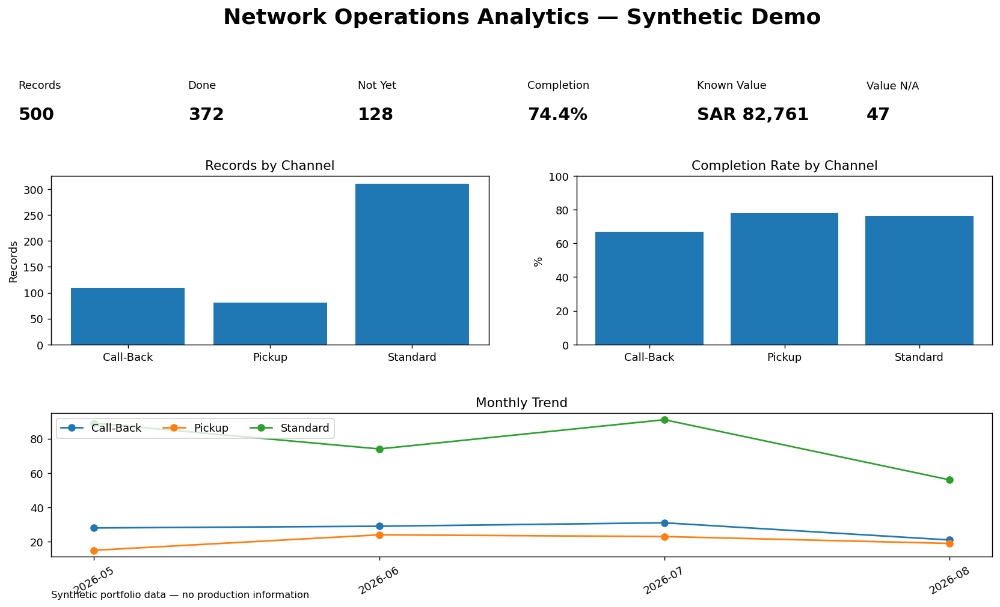
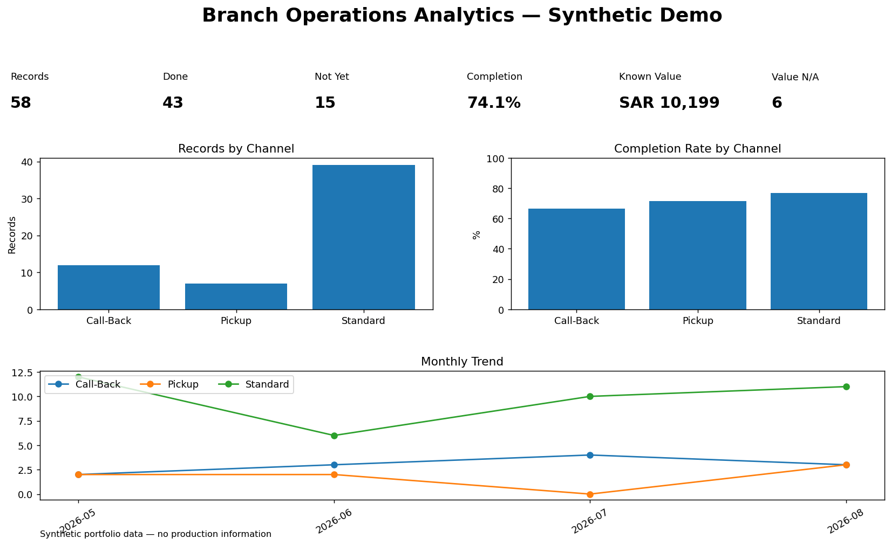

# Prescription Operations Analytics & Workflow Platform

> Production-style healthcare prescription operations and analytics platform
> demonstrating multi-pharmacy workflow design, secure data handling,
> operational analytics, procurement, delivery, transfers, notifications, and
> collaboration using ASP.NET Core, SQL Server, EF Core, Python, SQL, and Power
> BI concepts.

This public repository is a documentation-first, synthetic-data portfolio. It
describes verified engineering patterns from a private operational application
without publishing the production-style source, confidential configuration, or
real operational data.

## 1. Executive Summary

The platform coordinates prescription work across a pharmacy network while
keeping each pharmacy's records isolated. It combines transactional workflows,
central administration, data-quality controls, auditability, and operational
analytics. The public edition pairs detailed architecture documentation with
curated code examples, generic SQL, reproducible synthetic data, and an existing
Python/Streamlit analytics companion.

## 2. Business Problem

Fragmented spreadsheets and manual handoffs make it difficult to identify the
current prescription state, prevent duplicates, monitor refill dates, aggregate
missing items, coordinate delivery, or audit cross-branch transfers. A governed
system must provide one source of truth without allowing one pharmacy to access
another pharmacy's data.

Read the [business problem and objectives](docs/business_requirements/business-problem.md).

## 3. Project Objectives

- Model prescription operations as explicit, validated workflows.
- Enforce server-side pharmacy ownership and role-based access.
- Preserve historical quantities and price snapshots.
- Prevent duplicate active records and conflicting workflow actions.
- Connect Missing Items, Procurement, Delivery, and Transfers.
- Provide network and pharmacy-level analytics from governed data.
- Demonstrate privacy-by-design through synthetic public artifacts.

## 4. Real-World Use Case

The design represents a multi-pharmacy healthcare network receiving electronic
prescription records through several operational channels. Pharmacy teams process
records, manage item shortages, request delivery support, and transfer work when
needed. Administrators route imports, manage pharmacies, coordinate procurement
and delivery batches, and monitor network performance.

This portfolio does **not** claim hospital deployment and does not present its
synthetic dataset as real operational evidence.

## 5. Technology Stack

| Layer | Technologies and patterns |
|---|---|
| Operational web application | .NET 10, ASP.NET Core Razor Pages, PageModels |
| Persistence | EF Core 10, SQL Server, migrations, indexes, check constraints |
| Identity and security | ASP.NET Core Identity, Admin/Pharmacy RBAC, secure cookies |
| Operational services | Query helpers, transactional services, audit logging |
| Excel | ClosedXML import/export patterns |
| Browser UI | Razor, JavaScript, Bootstrap, Chart.js concepts |
| Analytics companion | Python, pandas, Streamlit, Plotly, SQL, Power BI documentation |
| Portfolio validation | pytest, PowerShell publication checks, GitHub Actions |

## 6. High-Level Architecture

```text
Browser
  -> ASP.NET Core Razor Pages
  -> PageModels and backend authorization
  -> Application services and query helpers
  -> EF Core
  -> SQL Server (source of truth)

Supporting components:
Identity | Notifications | Chat | Private Attachments | Excel | AuditLog
```

Business persistence remains server-side; browser local storage is not treated
as a system of record. See the [architecture documentation](docs/architecture/).

## 7. Core Business Domains

| Domain | Responsibility |
|---|---|
| Incoming Records | Controlled import, routing, rejection, and active uniqueness |
| WL e-RXs | Full dispensing, scheduling, preparation, and delivery lifecycle |
| Run-X e-RXs | Independent item review and final decision with value eligibility |
| Pick-up e-RXs | Independent item review and final decision without value threshold |
| Missing Items | Pharmacy queues and item-level requirement aggregation |
| Procurement | Admin pull batches with historical line snapshots |
| Delivery | Pharmacy requests, Admin pull/export, and delivery processing |
| Transfers | Pre-dispense, delivery, and return-to-origin coordination |
| Collaboration | Notifications, direct chat, broadcast, attachments, and location |
| Analytics | Pharmacy and network KPIs, trends, value, items, and schedules |

## 8. Prescription Lifecycle

The platform separates a full WL lifecycle from the focused Run-X and Pick-up
workflows. This prevents unrelated Solver, Preparation, Delivery, and scheduling
states from leaking into channels that do not use them.

See [WL lifecycle](docs/workflows/wl-prescription-lifecycle.md),
[Run-X](docs/workflows/run-x-workflow.md), and
[Pick-up](docs/workflows/pick-up-workflow.md).

## 9. WL e-RXs

WL records support Prescription Groups, sequential dispenses, Wasfaty decisions,
items, Solver, Preparation, Missing Items, Delivery Requests, Admin pulls,
delivery, transfer/return, and completion. Duplicate/New Dispense creates a new
workflow while retaining historical item price snapshots.

## 10. Run-X e-RXs

Run-X is independent from WL. `Done` requires at least one item and a known total
strictly greater than SAR 200. Exactly SAR 200 is not eligible. `Not Yet` may be
saved without items; an empty item set is `N/A`, not zero.

## 11. Pick-up e-RXs

Pick-up is a separate final-decision workflow. `Done` requires at least one item,
while `Not Yet` may have no items. It has no SAR 200 rule, and empty items remain
`N/A`.

## 12. Upcoming / Due / Overdue

- Upcoming: a future `NextFillAtUtc`, with no maximum horizon.
- Due: Saudi calendar dates from Today through Today+5 inclusive.
- Overdue: Next Fill date before Saudi Today.

Due and Overdue do not overlap. Details are in
[prescription scheduling](docs/workflows/prescription-scheduling.md).

## 13. Missing Items

Missing items flow from prescription line gaps into a pharmacy operational queue
and Item Summary. Records remain pharmacy-scoped, while Admin receives an
authorized network aggregation. See
[Missing Items and Procurement](docs/workflows/missing-items-procurement.md).

## 14. Procurement

Admin selects unpulled requirements, creates an immutable batch snapshot, exports
the batch, and retains history. Historical snapshots preserve what was requested
even when the current prescription or item master later changes.

## 15. Delivery

Pharmacies create Delivery Requests from eligible records. Admin processes a
central queue, creates pull batches, exports operational files, and coordinates
completion or transfer. See [delivery workflow](docs/workflows/delivery.md).

## 16. Transfers

The transfer model distinguishes original, source, and destination prescription
references and supports Pre-Dispense, Delivery, and Return-to-Original flows.
`RowVersion` protects acceptance from concurrent updates. See
[transfer workflow](docs/workflows/transfers.md).

## 17. Admin Operations

Admin capabilities include Incoming Records routing, pharmacy account management,
Item Master import, global prescription histories, delivery pulls, procurement,
rejected reports, audit-aware mutations, and network analytics.

## 18. Notifications

Notifications are recipient-specific, include unread state and target URLs, and
use deduplication keys for operational events. Pharmacy and Admin events remain
server-authorized. See [notifications](docs/workflows/notifications.md).

## 19. Internal Chat

The chat design supports direct conversations, participant authorization, unread
counts, message-history pagination, Admin broadcast, and message notifications.
See [internal chat](docs/workflows/internal-chat.md).

## 20. Secure Attachments

SQL Server stores metadata while files use private storage outside the public web
root. Uploads use GUID storage names, allowlisted types, size limits, extension/
content-type/signature checks, path containment, and authorized download handlers.
No real attachment is included here. See
[attachment security](docs/security/attachment-security.md).

## 21. Excel Import / Export

The architecture supports validated Single Pharmacy and Bulk Routing imports,
rejected-row reports, Item Master imports, multi-sheet prescription exports,
Missing Item/Procurement exports, and delivery pull files. The public examples
show safe patterns only; they contain no operational workbooks.

## 22. Data Model

Core relationships connect Pharmacy and ApplicationUser ownership, Incoming
Records, Prescription Groups and dispenses, items and historical prices, Missing
Items, Procurement batches, Delivery Requests, Transfers, notifications, chat,
and audit records. See the [domain model](docs/data_model/domain-model.md),
[ERD](docs/data_model/entity-relationships.md), and
[data dictionary](docs/data_dictionary/core-entities.md).

## 23. Security Architecture

ASP.NET Core Identity, Admin/Pharmacy roles, backend ownership checks, inactive
account enforcement, password-change requirements, secure cookies, HSTS/HTTPS,
audit logs, optimistic concurrency, and database constraints form layered
controls. See [security documentation](docs/security/).

## 24. Pharmacy Isolation

Every Pharmacy-owned query or mutation derives `PharmacyId` from the authenticated
user. Route, query-string, form, hidden-field, and JavaScript values are not
ownership authorities. Isolation is implemented consistently in PageModels and
services rather than with EF Global Query Filters; this trade-off is documented
explicitly in [pharmacy isolation](docs/security/pharmacy-isolation.md).

## 25. Data Quality & Validation

Controls cover active logical duplicates, positive quantities, non-negative
prices, sort order, required items for completed workflows, N/A semantics,
duplicate Solver invoices, procurement pulls, transfer state, uploads, and
concurrency. See [data-quality rules](docs/validation/data-quality-rules.md).

## 26. Analytics & KPIs

The operational application exposes Pharmacy and Admin analytical sections for
WL, Run-X, Pick-up, schedules, Missing Items, value, items, delivery, transfers,
and pharmacy performance. KPI definitions are governed in the
[operational KPI dictionary](docs/kpi_dictionary/operational-kpis.md).

### Operational Analytics Companion

The original safe Python, Streamlit, SQL, and Power BI layer is preserved. It
demonstrates how structured workflow data can be analyzed without publishing the
transactional application. Start with [Analytical Methodology](docs/ANALYTICAL_METHODOLOGY.md)
and [Power BI Build Guide](powerbi/README.md).

## 27. Synthetic Demo Data

All public datasets are synthetic. The curated workflow examples use identifiers
such as `DEMO-PH-001`, `DEMO-RX-000001`, and `SYN-NID-000001`; they are not
production exports. See [sample-data/README.md](sample-data/README.md).

## 28. Dashboard / Screenshot Preview

Existing analytics screenshots were generated from synthetic data:





The [screenshot plan](docs/screenshots/SCREENSHOT_PLAN.md) defines future
synthetic operational visuals. No private application screenshot is used.

## 29. Technical Decisions

Architecture Decision Records explain Razor Pages, application-level isolation,
historical price snapshots, SQL-enforced uniqueness, private attachments,
operational snapshots, and server-side query filtering. Browse
[technical decisions](docs/technical_decisions/).

## 30. Lessons Learned

The project reinforced that tenant isolation must be systematic, runtime testing
finds issues that compilation cannot, historical values must be immutable, shared
query logic prevents dashboard/page drift, and database constraints should
reinforce application validation. See [project lessons](docs/lessons_learned/project-lessons.md).

## 31. Repository Structure

```text
docs/          Architecture, workflows, security, model, KPIs, validation, ADRs
diagrams/      Mermaid sources and future rendered artifacts
examples/      Curated EF Core, Razor Pages, validation, and Excel examples
sql/           Existing analytics SQL plus generic workflow examples
sample-data/   Small explicit workflow-oriented synthetic datasets
data/sample/   Existing larger analytics companion dataset
src/           Existing Python analytics companion
powerbi/       Reproducible Power BI documentation; no PBIX is included
tests/         Analytics, publication-safety, and synthetic-data tests
scripts/       Local publication validation scripts
.github/       Public CI validation workflows
```

## 32. How to Explore the Repository

1. Read the [documentation index](docs/README.md).
2. Follow the [system context](docs/architecture/system-context.md).
3. Walk through the workflow documents.
4. Review the curated [code examples](examples/) and [SQL examples](sql/).
5. Inspect the synthetic datasets.
6. Run `pytest -q` and `pwsh -File scripts/validate-publication.ps1`.
7. Optionally run the existing analytics demo with `streamlit run app.py`.

## 33. Privacy & Publication Safety

The repository is governed by a [publication allowlist](PUBLICATION_ALLOWLIST.md),
[denylist](PUBLICATION_DENYLIST.md), and
[sanitization manifest](SANITIZATION_MANIFEST.md). Automated checks reject
database artifacts, sensitive paths, secret-like assignments, realistic identity
patterns, and oversized files.

## 34. Limitations

- The private transactional application is not included or deployable from this repository.
- Synthetic screenshots do not prove production runtime behavior.
- Power BI is documented, but no `.pbix` or `.pbit` file is published.
- Curated examples illustrate patterns and are not drop-in production modules.
- Pharmacy isolation is documented from verified application logic, not exercised by this public demo.

## 35. Portfolio Disclaimer

This is a reconstructed, generalized portfolio edition based on a production-style
engineering project. It contains no real patient, prescription, pharmacy,
employee, credential, attachment, infrastructure, or company dataset. All public
data and examples are synthetic or sanitized and should be evaluated as portfolio
evidence, not as a deployable healthcare product.
