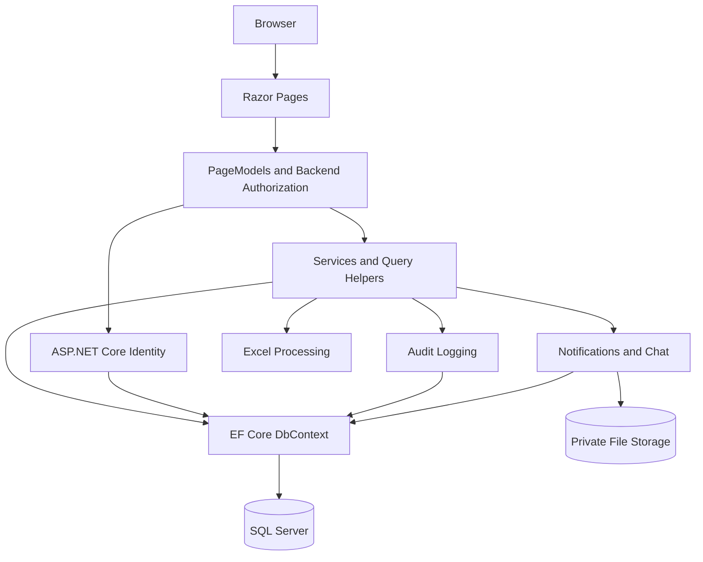

# Application Architecture Diagram

```mermaid
flowchart TB
    Browser[Browser]
    Pages[Razor Pages]
    Models[PageModels and Backend Authorization]
    Services[Services and Query Helpers]
    Identity[ASP.NET Core Identity]
    Audit[Audit Logging]
    Excel[Excel Processing]
    Chat[Notifications and Chat]
    Ef[EF Core DbContext]
    Sql[(SQL Server)]
    Storage[(Private File Storage)]

    Browser --> Pages --> Models --> Services --> Ef --> Sql
    Models --> Identity
    Services --> Audit
    Services --> Excel
    Services --> Chat
    Chat --> Storage
    Identity --> Ef
    Audit --> Ef
    Chat --> Ef
```
