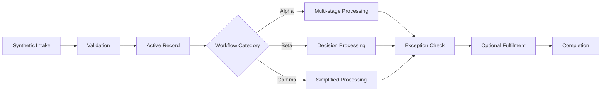

# Generic Workflow Lifecycle Diagram

`Workflow Alpha`, `Workflow Beta`, and `Workflow Gamma` are fictional labels. The diagram demonstrates generic state-machine concepts and must not be interpreted as a real organization workflow.
