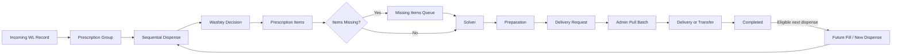

# Prescription Lifecycle Diagram

```mermaid
flowchart LR
    Incoming[Incoming WL Record]
    Group[Prescription Group]
    Dispense[Sequential Dispense]
    Decision[Wasfaty Decision]
    Items[Prescription Items]
    Missing{Items Missing?}
    MissingQueue[Missing Items Queue]
    Solver[Solver]
    Preparation[Preparation]
    DeliveryRequest[Delivery Request]
    AdminPull[Admin Pull Batch]
    Delivery[Delivery or Transfer]
    Complete[Completed]
    NextFill[Future Fill / New Dispense]

    Incoming --> Group --> Dispense --> Decision --> Items --> Missing
    Missing -->|Yes| MissingQueue --> Solver
    Missing -->|No| Solver
    Solver --> Preparation --> DeliveryRequest --> AdminPull --> Delivery --> Complete
    Complete -->|Eligible next dispense| NextFill --> Dispense
```

Run-X and Pick-up use separate final-decision workflows and do not traverse this
full WL lifecycle.
