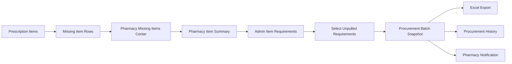

# Missing Items and Procurement Diagram

```mermaid
flowchart LR
    Prescription[Prescription Items]
    Missing[Missing Item Rows]
    Center[Pharmacy Missing Items Center]
    Summary[Pharmacy Item Summary]
    Requirements[Admin Item Requirements]
    Select[Select Unpulled Requirements]
    Batch[Procurement Batch Snapshot]
    Export[Excel Export]
    History[Procurement History]
    Notify[Pharmacy Notification]

    Prescription --> Missing --> Center --> Summary --> Requirements --> Select --> Batch
    Batch --> Export
    Batch --> History
    Batch --> Notify
```
