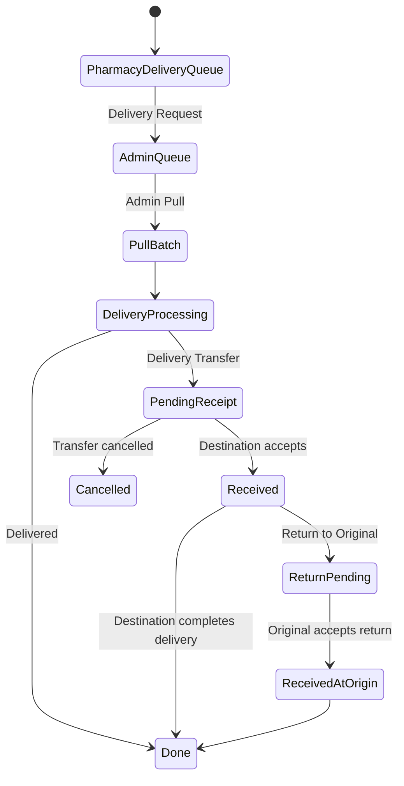

# Delivery and Transfer Flow Diagram

```mermaid
stateDiagram-v2
    [*] --> PharmacyDeliveryQueue
    PharmacyDeliveryQueue --> AdminQueue: Delivery Request
    AdminQueue --> PullBatch: Admin Pull
    PullBatch --> DeliveryProcessing
    DeliveryProcessing --> Done: Delivered
    DeliveryProcessing --> PendingReceipt: Delivery Transfer
    PendingReceipt --> Received: Destination accepts
    PendingReceipt --> Cancelled: Transfer cancelled
    Received --> Done: Destination completes delivery
    Received --> ReturnPending: Return to Original
    ReturnPending --> ReceivedAtOrigin: Original accepts return
    ReceivedAtOrigin --> Done
```

Pre-dispense transfers follow the same Pending Receipt/Received/Cancelled control
states but allow the destination to continue the full WL workflow.
