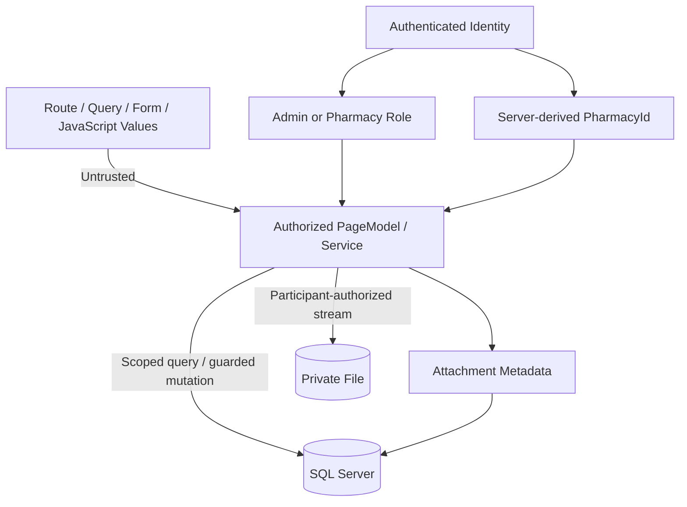

# Security Boundary Diagram

```mermaid
flowchart TB
    Input[Route / Query / Form / JavaScript Values]
    Auth[Authenticated Identity]
    Role[Admin or Pharmacy Role]
    Ownership[Server-derived PharmacyId]
    Handler[Authorized PageModel / Service]
    Db[(SQL Server)]
    Metadata[Attachment Metadata]
    PrivateFile[(Private File)]

    Input -->|Untrusted| Handler
    Auth --> Role --> Handler
    Auth --> Ownership --> Handler
    Handler -->|Scoped query / guarded mutation| Db
    Handler --> Metadata --> Db
    Handler -->|Participant-authorized stream| PrivateFile
```

Client-supplied Pharmacy identifiers never replace the authenticated user's
server-side ownership context.
