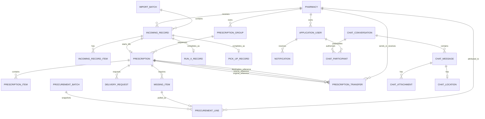

# Entity Relationships

This ERD is intentionally curated. It shows major business relationships without
reproducing the complete private EF Core model.

## Important cardinality observations

- One logical Prescription Group can have multiple sequential dispenses.
- One incoming record completes into only its appropriate workflow record.
- One prescription may have many item/missing/delivery/transfer-related rows.
- A procurement line references one Missing Item snapshot and one Pharmacy.
- A user accesses a chat conversation only through participant membership.

## Ownership

Pharmacy ownership exists directly on core operational entities or is reachable
through a required relationship. Pharmacy handlers still apply explicit scoped
predicates; relationship existence alone is not authorization.
